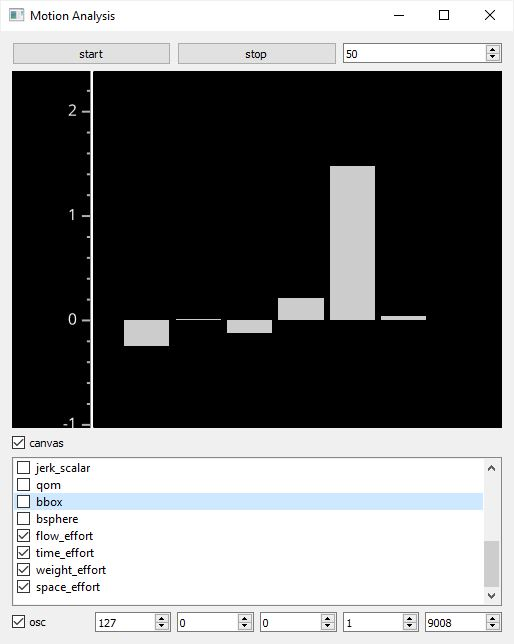

# AI-Toolbox - Motion Analysis - Mocap Analysis Python



Figure 1: Screenshot of the Python-version of the motion analysis tool. In this screenshot , the bounding box is shown as bar graph and the four Laban Efforts (Flow, Time, Weight, Space) have been selected for OSC sending. 

## Summary

This Python-based tool provides a set of algorithms for analysing motion capture recordings in real-time. The following analysis functions are provided: positional derivatives (velocity, acceleration, jerk, and quantity of motion),  pose expansion (bounding box, bounding sphere) and Laban Effort Factors (Flow, Time,  Space, Weight). The tool receives motion capture data via [OSC](https://en.wikipedia.org/wiki/Open_Sound_Control) and sends the analysis results also via [OSC](https://en.wikipedia.org/wiki/Open_Sound_Control). 

### Installation

The tool runs within the *premiere* anaconda environment. For this reason, this environment has to be setup beforehand.  Instructions how to setup the *premiere* environment are available as part of the [installation documentation ](https://github.com/bisnad/AIToolbox/tree/main/Installers) in the [AI Toolbox github repository](https://github.com/bisnad/AIToolbox). 

The tool can be downloaded by cloning the [MotionAnalysis Github repository](https://github.com/bisnad/MotionAnalysis). After cloning, the tool is located in the MotionAnalysis / MocapAnalysisPython directory.

### Directory Structure

MocapAnalysisPython (contains tool specific python scripts)

- configs (contains estimates of body part weights for different skeleton representations)
- data 
  - media (contains media used in this Readme)

## Usage
#### Start

The tool can be started either by double clicking the mocap_analysis.bat (Windows) or mocap_analysis.sh (MacOS) shell scripts or by typing the following commands into the Anaconda terminal:

```
conda activate premiere
cd MocapAnalysisPython
python mocap_analysis.py
```

During startup, the tool reads first from the folder "configs" a configuration file. Based on this file, the tool assigns weights to joints. The following configurations files have been prepared for different motion capture and pose estimation systems:

- configs/joint_weights_captury_bvh.json : [Captury](https://captury.com/) Mocap Recording without hand tracking, BVH Format
- configs/joint_weights_captury_fbx.json : [Captury](https://captury.com/) Mocap Recording without hand tracking, FBX Format
- configs/joint_weights_qualisys_hands_bvh.json : [Qualisys](https://www.qualisys.com/) Mocap Recording with hand tracking, BVH Format
- configs/joint_weights_qualisys_hands_fbx.json : [Qualisys](https://www.qualisys.com/) Mocap Recording  with hand tracking, FBXFormat
- configs/joint_weights_xsens_bvh.json : [XSens](https://www.movella.com/products/motion-capture) Mocap Recording without hand tracking, BVH Format
- configs/joint_weights_xsens_fbx.json : [XSens](https://www.movella.com/products/motion-capture) Mocap Recording without hand tracking, FBX Format
- configs/joint_weights_coco.json : 2D Pose Estimation Recording based on the [COCO skeleton](https://github.com/bisnad/MotionAnalysis/blob/main/PoseEstimation/MMPose/data/media/COCO_Skeleton.jpg) 
- configs/joint_weights_halpe26_pkl.json : 2D Pose Estimation Recording based on the [Halpe26 skeleton](https://github.com/bisnad/MotionAnalysis/blob/main/PoseEstimation/MMPose/data/media/Halpe26_Skeleton.jpg) 
- configs/joint_weights_zed34_fbx.json : 3D Pose Estimation based on the Stereolabs [Body34 skeleton](https://github.com/bisnad/MotionAnalysis/blob/main/PoseEstimation/ZED/data/media/body34_skeleton.png)

At the moment, the tool loads by default the configuration file that corresponds to XSens mocap recordings in FBX format. To read a different configuration file,  the following source code in the file mocap_analysis.py has to be modified:

```
mocap_joint_weights_path = "configs/joint_weights_xsens_fbx.json"
mocap_pos_dim = 3
```

The string value assigned to the variable  `mocap_joint_weights_path` needs to be replaced with the path to the configuration file. 
The integer value assigned to the variable `mocap_pos_dim` indicates whether joint positions are 3 or 2 dimensional. By default, this value is 3, but needs to be changed to 2 for 2D pose estimation data. 

#### Functionality

The tool receives live motion capture data via OSC messages. These messages contain joint positions represented as sequence of 3D or 2D vectors. The tool then passes this joint information through an analysis pipeline to extract low and mid level motion descriptors. 

Low level descriptors that are computed for each joint individually include: 

`pos_world` : joint positions in world coordinates and meters (this unit doesn't apply to 2D pose estimation data)

`pos_smooth` : smoothed joint positions

`pos_scalar` : scalar joint positions as distances from an the center in the mocap space

`velocity` : linear joint velocities in meters / second  (this unit doesn't apply to 2D pose estimation data)

`velocity_smooth` : smoothed linear joint velocities

`velocity_scalar` : scalar linear joint  velocities

`acceleration` : linear joint accelerations in meters / second^2  (this unit doesn't apply to 2D pose estimation data)

`acceleration_smooth` : smoothed linear joint accelerations

`acceleration_scalar` : scalar linear joint accelerations

`jerk`: linear joint jerks in meters / second^3  (this unit doesn't apply to 2D pose estimation data)

`jerk_smooth` : smoothed linear joint jerks

`jerk_scalar` : scalar linear joint jerks

Low level descriptors that are computed for all joints combined:

`qom` : quantity of motion of all joints combined in kg * meters / seconds

`bbox` : minimum and maximum corner position of bounding box of all joints combined in meters

`bsphere` : center position and radius of bounding sphere of all joints combined in meters

Mid level descriptors that are computed for all joints combined:

`weight_effort` : scalar linear Laban Weight Effort of all joints combined

`space_effort` : scalar linear Laban Space Effort of all joints combined

`time_effort` : scalar linear Laban Time Effort of all joints combined

`flow_effort` : scalar linear Laban Flow Effort of all joints combined

The tool automatically computes all these descriptors, the user can select which of these descriptors to display as a bar graph and which of these descriptors to send as OSC messages. 

#### Graphical User Interface

The user interface consists of the following elements from top left to right bottom. Buttons to start and stop the analysis of incoming motion capture data. A number box to set the number of times per second the analysis is computed. A graphics pane to display a single motion descriptor as a bar graph. A toggle to activate / deactivate the graphing display. A scrollable list of motion descriptor names each with a toggle next to it. Turning the toggle on activates sending of the motion descriptor via OSC (if OSC sending is globally turned on)  whereas highlighting the motion descriptor name displays the corresponding descriptor values as bar graph (if the graphing display is activated). A toggle to globally turn on / off OSC sending. Four integer number boxes to set the the IP address to which OSC data is sent to. A single integer number box to set zhe port to which OSC data is sent to.

## OSC Communication

The tool receives OSC messages that represent joint positions of a single skeleton. These messages contains all the joint positions grouped together. In the OSC messages described below, N represents the number of joints. Depending on the motion capture or pose estimation system that detects the joint positions, the positions are two or three dimensional

- joint positions as list of vectors in world coordinates: `/mocap/0/joint/pos_world <float j1x> <float j1y> (<float j1z>) .... <float jNx> <float jNy> (<float jNz>)` 

The tool sends OSC messages representing the motion descriptors that have been selected by the user for sending. For each motion descriptor, all descriptor values are grouped together into a single OSC message. The following OSC messages can be sent by the tool:

- joint positions as list of vectors in world coordinates: `/mocap/0/joint/pos_world <float j1x> <float j1y> (<float j1z>) .... <float jNx> <float jNy> (<float jNz>)`
- smoothed joint positions as list of vectors in world coordinates: `/mocap/0/joint/pos_smooth <float j1x> <float j1y> (<float j1z>) .... <float jNx> <float jNy> (<float jNz>)`
- scalar joint positions as list of values: `/mocap/0/joint/pos_smooth <float j1x> <float j1> .... <float jN>`
- linear joint velocities as list of vectors: `/mocap/0/joint/velocity <float j1x> <float j1y> (<float j1z>) .... <float jNx> <float jNy> (<float jNz>)`
- smoothed linear joint velocities as list of vectors: `/mocap/0/joint/velocity_smooth <float j1x> <float j1y> (<float j1z>) .... <float jNx> <float jNy> (<float jNz>)`
- scalar joint velocities as list of values: `/mocap/0/joint/velocity_scalar <float j1x> <float j1> .... <float jN>`
- linear joint accelerations as list of vectors: `/mocap/0/joint/acceleration <float j1x> <float j1y> (<float j1z>) .... <float jNx> <float jNy> (<float jNz>)`
- smoothed linear joint accelerations as list of vectors: `/mocap/0/joint/acceleration_smooth <float j1x> <float j1y> (<float j1z>) .... <float jNx> <float jNy> (<float jNz>)`
- scalar joint accelerations as list of values: `/mocap/0/joint/acceleration_scalar <float j1x> <float j1> .... <float jN>`
- linear joint jerks as list of vectors: `/mocap/0/joint/jerk <float j1x> <float j1y> (<float j1z>) .... <float jNx> <float jNy> (<float jNz>)`
- smoothed linear joint jerks as list of vectors: `/mocap/0/joint/jerk_smooth <float j1x> <float j1y> (<float j1z>) .... <float jNx> <float jNy> (<float jNz>)`
- scalar joint jerks as list of values : `/mocap/0/joint/jerk_scalar <float j1x> <float j1> .... <float jN>`
- quantity of motion as vector : `/mocap/0/qom <float x> <float y> (<float z>)`
- bounding box as two vectors representing the box corners: `/mocap/0/bbox <float c1x> <float c1y> (<float c1z>) <float c2x> <float c2y> (<float c2z>)`
- bounding sphere as one vectors and one value represented center position and radius respectively: `/mocap/0/bsphere <float cx> <float cy> (<float cz>) <float r>`
- scalar linear Weight Effort Factor as single float : `/mocap/0/weight_effort <float>` 
- scalar linear Time Effort Factor as single float : `/mocap/0/time_effort <float>` 
- scalar linear Flow Effort Factor as single float : `/mocap/0/flow_effort <float>` 
- scalar linear Space Effort Factor as single float : `/mocap/0/space_effort <float>` 

By default, the tool receives OSC messages from any IP address on port 9007. To change the address and / or port,  the following source code in the file mocap_analysis.py has to be modified:

```
motion_receiver.config["ip"] = "0.0.0.0"
motion_receiver.config["port"] = 9007
```

The string value assigned to the dictionary key `motion_receiver.config["ip"]` represents the IP address from which mocap data is received. "0.0.0.0" stands for any arbitrary IP.
The integer value assigned to the dictionary key `motion_receiver.config["port"]` represents the port on which mocap data is received.

To change the scaling factor that is applied to joint positions prior to computing any joint descriptors, the following source code in the file mocap_analysis.py has to be modified:

```
pipeline.posScale = 1.0
```

The float value assigned to the variable `pipeline.posScale` represents the scaling factor. A value of 1.0 corresponds to no scaling. A value of 0.01 would for example scale from cm to m. 

### Limitations and Bugs

- The tool only supports motion capture data representing a single person
- The tool currently doesn't compute any motion descriptors based on joint rotations
- The drawing of bar graphs is very slow