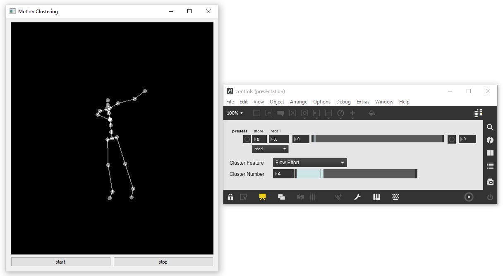

# AI-Toolbox - Motion Analysis - Clustering Interactive



Figure 1: Screenshot of the Motion Clustering tool. The window on the left shows the output of the tool as simple 3D stick figure. The window on the right is a Max/MSP patch that demonstrates how to send OSC messages to control the Motion Clustering tool. 

### Summary

This tool is a Python-based software for extracting motion segments from a motion capture recording and grouping the segments according to their similarity with regards to a chosen set of motion descriptors. While running, it sends skeleton joint data of the currently displayed motion segment in the form of local and global positions and local and global rotations via [OSC](https://en.wikipedia.org/wiki/Open_Sound_Control) to any destination address. Clustering Interactive can also be remote controlled via [OSC](https://en.wikipedia.org/wiki/Open_Sound_Control).

### Installation

The tool runs in the *premiere* anaconda environment. For this reason, this environment has to be setup beforehand.  Instructions how to setup the *premiere* environment are available as part of the [installation documentation ](https://github.com/bisnad/AIToolbox/tree/main/Installers) in the [AI Toolbox github repository](https://github.com/bisnad/AIToolbox). 

The tool can be downloaded by cloning the [MotionAnalysis Github repository](https://github.com/bisnad/MotionAnalysis). After cloning, the tool is located in the MotionAnalysis / ClusteringInteractive directory.

### Directory Structure

ClusteringInteractive (contains tool specific python scripts)

- common (contains python scripts for handling mocap data)
- configs (contains estimates of body part weights for different skeleton representations)
- controls (contains a MaxMSP patch to remote control the tool)
- data 
  - media (contains media used in this Readme)
  - mocap (contains an example mocap recording)

### Usage

#### Start

The tool can be started either by double clicking the clustering_interactive.bat (Windows) or clustering_interactive.sh (MacOS) shell scripts or by typing the following commands into the Anaconda terminal:

```
conda activate premiere
cd ClusteringInteractive
python clustering_interactive.py
```

#### Default Mocap File

When the tool starts, it automatically reads an example motion capture file that is located in the ClusteringInteractive/data/mocap folder. An alternative  mocap file can be read when the tool starts. To read a different mocap file during tool startup, the following source code in the file clustering_interactive.py has to be modified:

```
mocap_file_path = "data/mocap"
mocap_files = ["Muriel_Take1.fbx"]
mocap_pos_scale = 1.0
mocap_fps = 50
mocap_joint_weight_file = "configs/joint_weights_xsens_fbx.json"
```

The string value assigned to the variable  `mocap_file_path`  needs to be replaced with the path to the root directory that contains the mocap file(s).

The list of string values assigned  to the variable  `mocap_files` need to be replaced by a single or multiple strings, each one representing the name of a mocap file to be loaded. 

The float value assigned to the variable `mocap_pos_scale` represents a scaling factor for joint positions. This factor can be changed if the unit representing joint positions is not "cm". 

The integer value assigned to the variable `mocap_fps` can be changed to match the "frames per seconds" of the recording. 

The string value assigned to the variable `mocap_joint_weight_file` points to a configuration file that specifies the body part weights associated with skeleton joints. This configuration file should match the skeleton topology of the recording. Configuration files have been prepared for the following mocap systems and recording formats: 

- configs/joint_weights_captury_bvh.json : [Captury](https://captury.com/) Mocap Recording without hand tracking, BVH Format
- configs/joint_weights_captury_fbx.json : [Captury](https://captury.com/) Mocap Recording without hand tracking, FBX Format
- configs/joint_weights_qualisys_bvh.json : [Qualisys](https://www.qualisys.com/) Mocap Recording with hand tracking, BVH Format
- configs/joint_weights_qualisys_fbx.json : [Qualisys](https://www.qualisys.com/) Mocap Recording  with hand tracking, FBXFormat
- configs/joint_weights_xsens_bvh.json : [XSens](https://www.movella.com/products/motion-capture) Mocap Recording without hand tracking, BVH Format
- configs/joint_weights_xsens_fbx.json : [XSens](https://www.movella.com/products/motion-capture) Mocap Recording without hand tracking, FBXFormat
- configs/joint_weights_zed_body34_fbx.json : [Stereolabs ZED Body34](https://www.stereolabs.com/docs/body-tracking) Mocap Recording, FBX Format

#### Functionality

This tool reads a chosen motion capture recording and splits it into a number of motion segments whose duration and overlap can be specified by the user. The segments are subsequently analysed and the following motion descriptors are extracted: 3D joint positions, scalar joint distance to root joint, 3D joint velocity, scalar joint speed, 3D joint acceleration, scalar joint acceleration, 3D joint jerk, scalar joint jerk, quantity of motion, bounding box, bounding sphere, and the four [Laban Effort Factors](https://en.wikipedia.org/wiki/Laban_movement_analysis): Laban Weight Effort, Laban Space Effort, Laban Time Effort, Laban Flow Effort. The user can chose any number of motion descriptors as basis for clustering as well as the number of clusters that should be created for each motion descriptor.  Clustering is based on the [K-Means method](https://en.wikipedia.org/wiki/K-means_clustering). This method is applied for each selected motion descriptor separately. Once clustering has been completed, the tool plays the motion segments in a single cluster and displays them as an animation of a simple stick figure representation. The motion segments are played back in the sequence of their occurrence in the original motion capture recording and with a smooth interpolation between overlaps. Those settings that take effect when the tool starts need to be configured in the source code. These settings are the corresponding code sections are described below.

##### Mocap Settings

```
mocap_body_weight = 60
```

The float value assigned to the variable `mocap_body_weight` specifies the total body weight of the performer that has been recorded.

##### Model Settings

```
cluster_count = 20
cluster_random_state = 170
sequence_length = 48
sequence_overlap = 24
```

The integer value assigned to the variable `cluster_count` specifies the number of clusters to be created for each chosen motion descriptor.

The integer value assigned to the variable `cluster_random_state` specifies the initial seed for the K-Means clustering algorithm.

The integer value assigned to the variable `sequence_length` specifies the number of frames and therefore the duration of each motion segment. 

The integer value assigned to `sequence_overlap` specified the number of frames successive motion segments are overlapped and interpolated between.

##### Motion Descriptor Settings

```
mocap_features = {"qom": mocap_data["motion"]["qom"],
                  "bsphere": mocap_data["motion"]["bsphere"], 
                  "weight_effort": mocap_data["motion"]["weight_effort"],
                  "space_effort": mocap_data["motion"]["space_effort"],
                  "time_effort": mocap_data["motion"]["time_effort"],
                  "flow_effort": mocap_data["motion"]["flow_effort"]}
```

The variable `mocap_features` is a python dictionary that groups together the name and values of the motion descriptors that are used for clustering. The following name-value-pairs are available:

`"pos_world_m": mocap_data["motion"]["pos_world_m"]` : 3D joint positions in world coordinates and meters

`"pos_world_smooth": mocap_data["motion"]["pos_world_smooth"]` : smoothed 3D joint positions

`"pos_scalar": mocap_data["motion"]["pos_scalar"]` : scalar joint positions as distances from root joint (typically the center of the hip)

`"vel_world": mocap_data["motion"]["vel_world"]` : 3D joint velocities in meters / second

`"vel_world_smooth": mocap_data["motion"]["vel_world_smooth"]` : smoothed  3D joint velocities

`"vel_world_scalar": mocap_data["motion"]["vel_world_scalar"]` : scalar joint speeds

`"accel_world": mocap_data["motion"]["accel_world"]` : 3D joint accelerations in meters / second^2

`"accel_world_smooth": mocap_data["motion"]["accel_world_smooth"]` : smoothed  3D joint accelerations

`"accel_world_scalar": mocap_data["motion"]["accel_world_scalar"]` : scalar joint accelerations

`"jerk_world": mocap_data["motion"]["jerk_world"]` : 3D joint jerks in meters / second^3

`"jerk_world_smooth": mocap_data["motion"]["jerk_world_smooth"]` : smoothed 3D joint jerks

`"jerk_world_scalar": mocap_data["motion"]["jerk_world_scalar"]` : scalar joint jerks

`"qom": mocap_data["motion"]["qom"]` : quantity of motion of all joints combined in kg * meters / seconds

`"bbox": mocap_data["motion"]["bbox"]` : minimum and maximum 3D corner position of bounding box of all joints combined in meters

`"bsphere": mocap_data["motion"]["bsphere"]` : 3D center position and radius of bounding sphere of all joints combined in meters

`"weight_effort": mocap_data["motion"]["weight_effort"]` : scalar Laban Weight Effort of all joints combined

`"space_effort": mocap_data["motion"]["space_effort"]` : scalar Laban Space Effort of all joints combined

`"time_effort": mocap_data["motion"]["time_effort"]` : scalar Laban Time Effort of all joints combined

`"flow_effort": mocap_data["motion"]["flow_effort"]` : scalar Laban Flow Effort of all joints combined

### Graphical User Interface

The tool provides a minimal GUI  for starting and stopping the skeleton animation playback.

### OSC Communication

The tool sends the following OSC messages representing the joint positions and rotations of the currently displayed motion capture figure.
Each message contains all the joint positions and rotations grouped together. In the OSC messages described below, N represents the number of joints.

The following OSC messages are sent by the tool:

- joint positions as list of 3D vectors in world coordinates: `/mocap/0/joint/pos_world <float j1x> <float j1y> <float j1z> .... <float jNx> <float jNy> <float jNz>` 
- joint rotations as list of Quaternions in world coordinates: `/mocap/0/joint/rot_world <float j1w> <float j1x> <float j1y> <float j1z> .... <float jNw> <float jNx> <float jNy> <float jNz>` 

By default, the tool sends its OSC messages to the local IP address and to port 9004. To change this port, the following source code in the file clustering_interactive.py has to be modified:

```
osc_send_ip = "127.0.0.1"
osc_send_port = 9004
```

The string assigned to the variable `osc_send_ip` represents the IP address of the computer to which the tool sends OSC messages. 

The integer assigned to the variable `osc_send_port` represents the port of the computer to which the tool sends OSC messages. 

The tool can be remote controlled by sending OSC messages to it. By default, the tool receives OSC messages on port 9002. To change this port, the following source code in the file clustering_interactive.py has to be modified:

```
osc_receive_ip = "0.0.0.0"
osc_receive_port = 9002
```

The string assigned to the variable `osc_receive_ip` represents the IP address of the computer that sends OSC messages to the tool. 

The string assigned to the variable `osc_receive_port` represents the port on which the tool is listening to incoming OSC messages.

An example Max patch demonstrates the use of the remote control functionality. The following OSC messages can be used to remote control the tool. 

- select a motion descriptor for clustering: `/synth/motionfeature <string name_of_motion_descriptor>`
- select a cluster for playback: `/synth/clusterlabel <int cluster_index>`

### Limitations and Bugs

The tool only supports motion capture recordings that contain a single person.
The tool reads only motion capture recordings in FBX format in which each skeleton pose has its own keyframe and in which the number of keyframes is the same for all skeleton joints.
Only individual motion descriptors can be used for clustering but not combinations of descriptors.
