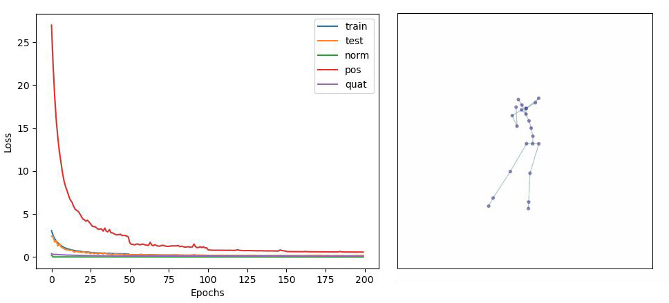

## AI-Toolbox - Motion Continuation - RNN



Figure 1. Screenshot of the Motion Continuation tool after training concluded. The image on the left depicts the learning progress as graph plot. The image on the right is a still from a GIF animation that shows a motion generated by the model.

### Summary

This Python-based tool implements a machine learning model that can be trained to generate synthetic motion data that represent a continuation of an short motion excerpt.  This tool doesn't operate in real-time and is used exclusively for training the machine learning model. Once a model is trained, it can be used in combination with other tools that generate synthetic motions in real-time and can be interactively controlled. 

### Installation

The software runs within the *premiere* anaconda environment. For this reason, this environment has to be setup beforehand.  Instructions how to setup the *premiere* environment are available as part of the [installation documentation ](https://github.com/bisnad/AIToolbox/tree/main/Installers) in the [AI Toolbox github repository](https://github.com/bisnad/AIToolbox). 

The software can be downloaded by cloning the [MotionContinuation Github repository](https://github.com/bisnad/MotionContinuation). After cloning, the software is located in the MotionContinuation / rnn directory.

### Directory Structure

- rnn
  - common (contains python scripts for handling mocap data)
  - data 
    - configs (contains configurations for skeleton representations used by various Pose Estimation systems and lists of loss weights for joints in skeletons that include hand joints)
    - media (contains media used in this Readme)
    - mocap (contains an example mocap recording)
  - results
    - anims (after training, contains synthetic motion data exported as Gif animations and FBX/BVH files)
    - histories (after training, contains logs of the training process as csv file and graph plot)
    - weights (after training, contains the weights of the trained model)

### Usage

#### Start

The tool exists in two versions. The version named `rnn` is used to train the machine learning model on motion data that stores both joint rotations and positions and that is stored in BVH or FBX format. The version named `rnn_pos` is used to train the machine learning model on motion data that stores only joint positions and that is stored in PKL format. The first version of the tool can be started by double clicking the rnn.bat (Windows) or rnn.sh (MacOS) shell scripts or by typing the following commands into the Anaconda terminal:

```
conda activate premiere
cd MotionContinuation/rnn
python rnn.py
```

The second version of the tool can be started by double clicking the rnn_pos.bat (Windows) or rnn_pos.sh (MacOS) shell scripts or by typing the following commands into the Anaconda terminal:

```
conda activate premiere
cd MotionContinuation/rnn
python rnn_pos.py
```

#### Functionality

##### RNN Motion Data Import

This tool imports motion data from one or several motion files that are stored either in FBX or BVH format. These motion files are then used to create the training set. By default, the tool loads the motion file `Muriel_Embodied_Machine_variation.fbx` in the `data/mocap` folder. To read different motion files, the the following source code in the file rnn.py has to be modified:

```
mocap_file_path = "data/mocap/"
mocap_files = ["Muriel_Embodied_Machine_variation.fbx"]
mocap_valid_frame_ranges = [ [ [ 200, 6400 ] ] ]
mocap_pos_scale = 1.0
mocap_fps = 50
mocap_loss_weights_file = None
```

The string value assigned to the variable `mocap_file_path` specifies the path to the folder that contains motion data files. The list of string values assigned to the variable `mocap_files` specifies the names of the motion data files that will be loaded. The nested list of integer values that is assigned to the variable `mocap_valid_frame_ranges` specifies for each motion data file the frame ranges that should be used for training. Each frame range is defined by a start and end frame. It is possible to specify multiple frame ranges per motion data file. Any frames outside of these frame ranges will be excluded from training. The float value assigned to the variable `mocap_pos_scale` specifies a scaling value that is applied to joint positions. The purpose of the scaling value is to bring the position values to cm units. The integer value assigned to the variable `mocap_fps` specifies the number of frames per second with which the motion data is stored. This value has no influence on training but affects the synthetic motion data that is exported at the end of a training run. The string value assigned to the variable `mocap_loss_weights_file` specifies the path to a configuration file that contains loss scales for skeleton joints. Loading such a configuration file is recommended for motion  data that contains multiple joints per hand in order to reduce the influence of the hand joints on the overall loss calculation during training. If the motion data doesn't contain multiple hand joints, then this variable can be set to `None`. 

##### RNN_Pos Motion Data Import

This tool imports motion data from one or several motion files that are stored in PKL format. These files can be created by recording the OSC messages generated by one of the Pose Estimation Tools included in the AI-Toolbox with the MocapRecorder tool. These motion files are then used to create the training set. By default, the tool loads the motion file `Stocos_Pose2D_BlumenBaile.pkl` in the `data/mocap` folder. To read different motion files, the the following source code in the file `rnn_pos.py` has to be modified:

```
mocap_config_file = "data/configs/COCO_config.json" 
mocap_file_path = "data/mocap/"
mocap_files = ["Stocos_Pose2D_BlumenBaile.pkl"]
mocap_valid_frame_ranges = [ [ [ 0, 5000 ] ] ]
mocap_sensor_ids = ["/mocap/0/joint/pos_world"]
mocap_root_joint_name = "Left_Hip"
mocap_fps = 30
mocap_joint_dim = 2
```

In the following, only the variables that differ from those in the `rnn.py` source file are described. The string value assigned to the variable `mocap_config_file` specifies the skeleton representation used by the Pose Estimation tool when creating the recording.  The list of string values assigned to the variable `mocap_sensor_ids` specify the address parts of the OSC messages that contain motion data required for created the dataset. The string value assigned to the variable `mocap_root_joint_name` specifies the name of the joint that serves as root joint.  The integer value assigned to the variable `mocap_joint_dim`specifies the number of dimensions of the joint positions. This value is 2 for motion data that has been captured with a 2D Pose Estimation tool, and 3 for motion data that has been captured with a 3D Pose Estimation tool.

#### Functionality

The tool extracts the required motion data from the imported motion files into motion sequences, splits these sequences into short segments to create the dataset, then constructs and initialises machine learning model, trains this model using on the dataset, and finally stores the trained models weights, the training history, and examples of original and generated motion sequences. 

##### Model Settings

The model consists of one or several [Long Short Term Memory](https://www.researchgate.net/publication/13853244_Long_Short-Term_Memory) (LSTM) layers. By default, there are 2 layers and 512 units per layer. When constructing the model, its weights can either be initialised with random values or with values that have been determined in a previous training run. To use different model settings, the the following source code in the file `rnn.py` or `rnn_pos.py` has to be modified:

```
rnn_layer_dim = 512
rnn_layer_count = 2

load_weights = False
rnn_weights_file = "results/weights/rnn_weights_epoch_200"
```

The integer value assigned to the variable `rnn_layer_dim` specifies the number of units per LSTM layer. The integer value assigned to the variable `rnn_layer_count` specifies the number of LSTM layers. The boolean value assigned to the variable `load_weights` specifies if the model should be initialised with previously stored weights or not. The string value assigned to the variable `rnn_weights_file` specifies the path to a previously exported weights file. 

##### Dataset Settings

The dataset consists of pairs of motion sequences that have been extracted from the loaded motion files. The first sequence in the pair represents the motion sequence that is passed to the model as input. The second sequence in the pair represents the continuation of the input sequence. The motion sequences consist of a time series of values that represent at each timestep a full skeleton pose. In the case of `rnn.py`,  a pose is represented by joint orientations using quaternions. In the case of `rnn_pos.py`, a pose is represented by joint positions using 2D or 3D vectors. 

##### Training Settings

During training, a short motion sequence is passed as input to the model and the model predicts the continuation of this sequence, one frame at the time. The continuation iterates over a user specified number of times. At each iteration step, the loss of the model is calculated by comparing the original continuation of this sequence with the one predicted by the model. Training uses a curriculum learning approach which means that the model predicts the next frame as a continuation of its own previously predicted frame(s) (rather than the frames from the dataset). This improves the models capability to correct its own prediction mistakes. 

##### RNN Training Settings

In `rnn.py`, the loss is calculated as a combination of several losses. These are: 

- norm_loss: loss based on the deviation of the predicted quaternions from unit length
- pos_loss: loss based on the deviation of the predicted joint positions from the correct joint positions. The joint positions are derived from joint rotations using forward kinematics. 
- quat_loss: loss based on the deviation of the predicted joint rotations from the correct joint rotations.

When running the tool, it employs default training settings. To change these settings, the follows source code in the file `rnn.py` has to be changed:

```
batch_size = 32
test_percentage = 0.1

seq_input_length = 64
seq_output_length = 10 # this is only used for non-teacher forcing scenarios

learning_rate = 1e-4
norm_loss_scale = 0.1
pos_loss_scale = 0.1
quat_loss_scale = 0.9
teacher_forcing_prob = 0.0
model_save_interval = 10

epochs = 200
```

The integer value assigned to the variable `batch_size` specifies the number of motion examples in a training batch. The float value assigned to the variable `test_percentage` specifies the percentage of training data used for testing the model. The integer value assigned to the variable `seq_input_length` specifies the length (in number of frames) that is used a input to the model. The integer value assigned to the variable `seq_output_length` specifies the number of frames over which the model predicts the continuation of the input. The float value assigned to the variable learning_rate specifies the initial learning rate. The float value assigned to the variable `norm_loss_scale` specifies the weighted contribution of the quaternion normalisation loss to the overall training loss. The float value assigned to the variable `pos_loss_scale` specifies its weighted contribution of the predicted joint positions loss to the overall training loss. The float value assigned to the variable `quat_loss_scale` specifies its weighted contribution to the predicted joint rotations loss to the overall training loss. The float value assigned to the variable `teacher_forcing_prob` specifies the probability of employing teacher forcing instead of curriculum learning for each training batch. The integer value assigned to the variable `model_save_interval` specifies the interval (in number of epochs) at which model weights are stored. The integer value assigned to the variable epochs specifies the number of `epochs` used for training.

##### RNN_Pos Training Settings

In `rnn_pos.py`, there is only one loss function:

- pos_loss: loss based on the deviation of the predicted joint positions from the correct joint positions. The joint positions are directly represented by the training data.

When running the tool, it employs default training settings. To change these settings, the follows source code in the file `rnn_pos.py` has to be changed:

```
batch_size = 32
test_percentage = 0.1

seq_input_length = 64
seq_output_length = 10 # this is only used for non-teacher forcing scenarios

learning_rate = 1e-4
pos_loss_scale = 1.0
teacher_forcing_prob = 0.0
model_save_interval = 10

epochs = 200
```

The role of these variables is the same as in `rnn.py`.

##### Training 

Once the dataset has been created and the model initialised, training begins and runs for the number of epochs specified by the user. During training, the tool prints for each epoch a log message to the console that provide information about the training progress. 

An example log message produced by `rnn.py` looks like this:

`epoch 1 : train: 3.2183 test: 3.4099 norm 0.2777 pos 28.5485 quat 0.3730 time 16.57`

The information specifies, from left to right: the epoch number, the loss on the train set, the loss on the test set, the quaternion normalisation loss, the joint position loss, the joint rotation loss, and the time elapsed.

An example log message produced by `rnn_pos.py` looks like this:

`epoch 1 : train: 0.7932 test: 0.6682 pos 0.7932 time 9.11`

The information specifies, from left to right: the epoch number, the loss on the train set, the loss on the test set, the joint position loss, and the time elapsed.

At the end of training, the tool displays the training history as graph plot, and stores the training history both as image and `.csv` file, the last model weights, and an original and predicted motion sequence exported either as BVH or FBX file and GIF animation in case of `rnn.py` or as PKL file and GIF animation in case of `rnn_pos.py`.

### Limitations and Bugs

- The tool only supports motion capture recordings that contain a single person.
- `rnn.py` reads only motion capture recordings in FBX format in which each skeleton pose has its own keyframe and in which the number of keyframes is the same for all skeleton joints.


