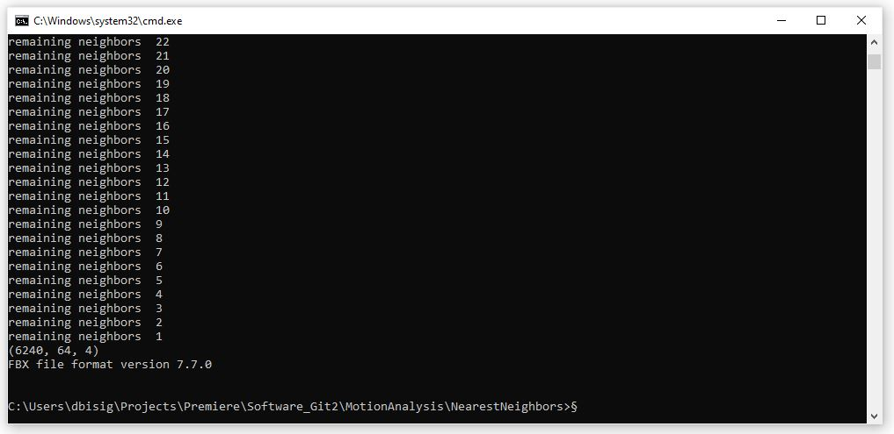

# AI-Toolbox - Motion Analysis - Nearest Neighbors



Figure 1. Screenshot of the command line output of the Nearest Neighbors tool. 

## Summary

This Python-based tool re-organises motion excerpts from a motion capture recording into a new sequence by conducting a nearest neighbor search. The tool takes as input a motion capture recording and splits it into motion excerpts. For each of these excerpts, motion descriptors are computed. These descriptors are then used to conduct a nearest neighbor search. The result of the search is a new list of motion excerpts that are sorted based on the similarity of their motion descriptors. The motion excerpts are then concatenated to create a new motion capture sequence that can be exported in FBX and/or BVH format or as a GIF animation.

### Installation

The tool runs within the *premiere* anaconda environment. For this reason, this environment has to be setup beforehand.  Instructions how to setup the *premiere* environment are available as part of the [installation documentation ](https://github.com/bisnad/AIToolbox/tree/main/Installers) in the [AI Toolbox github repository](https://github.com/bisnad/AIToolbox). 

The tool can be downloaded by cloning the [MotionAnalysis Github repository](https://github.com/bisnad/MotionAnalysis). After cloning, the tool is located in the MotionAnalysis / NearestNeighbors directory.

### Directory Structure

NearestNeighbors (contains tool specific python scripts)

- common (contains python scripts for handling mocap data)
  
- configs (contains estimates of body part weights for different skeleton representations)
  
- data
  - media (contains media used in this Readme)
  - mocap (contains an example mocap recording)
  
- results (contains the exported re-organised motion capture recording)


## Usage
#### Start

The tool can be started either by double clicking the nearest_neighbors.bat (Windows) or nearest_neighbors.sh (MacOS) shell scripts or by typing the following commands into the Anaconda terminal:

```
conda activate premiere
cd NearestNeighbors
python nearest_neighbors.py
```

#### Default Mocap File

When the tool starts, it automatically reads a motion capture file that is located in the NearestNeighbors/data/mocap folder. To read one or several different mocap files during tool startup, the following source code in the file clustering_interactive.py has to be modified:

```
mocap_file_path = "data/mocap"
mocap_files = ["polytopia_fullbody_take2.fbx"]
mocap_valid_frame_ranges = [ [ 200, 6400 ] ]
mocap_pos_scale = 1.0
mocap_fps = 50
mocap_joint_weight_file = "configs/joint_weights_qualisys_fbx.json"
```

The string value assigned to the variable  `mocap_file_path`  needs to be replaced with the path to the root directory that contains the mocap files(s).

The list of string values assigned  to the variable  `mocap_files` need to be replaced by a single or multiple strings, each one representing the name of a mocap files to be loaded. 

The list of list(s) of integer values assigned to the variable mocap_valid_frame_ranges specifies the minimum and maximum frame position to be used for each mocap file that is loaded. 

The float value assigned to the variable `mocap_pos_scale` represents a scaling factor for joint positions. This factor can be changed if the unit representing joint positions is not "cm". 

The integer value assigned to the variable `mocap_fps` can be changed to match the "frames per seconds" of the recordings. 

The string value assigned to the variable `mocap_joint_weight_file` points to a configuration file that specifies the body part weights associated with skeleton joints. This configuration file should match the skeleton topology in all the recordings. Configuration files have been prepared for the following mocap systems and recording formats: 

- configs/joint_weights_captury_bvh.json : [Captury](https://captury.com/) Mocap Recording without hand tracking, BVH Format
- configs/joint_weights_captury_fbx.json : [Captury](https://captury.com/) Mocap Recording without hand tracking, FBX Format
- configs/joint_weights_qualisys_bvh.json : [Qualisys](https://www.qualisys.com/) Mocap Recording with hand tracking, BVH Format
- configs/joint_weights_qualisys_fbx.json : [Qualisys](https://www.qualisys.com/) Mocap Recording  with hand tracking, FBXFormat
- configs/joint_weights_xsens_bvh.json : [XSens](https://www.movella.com/products/motion-capture) Mocap Recording without hand tracking, BVH Format
- configs/joint_weights_xsens_fbx.json : [XSens](https://www.movella.com/products/motion-capture) Mocap Recording without hand tracking, FBXFormat
- configs/joint_weights_zed_body34_fbx.json : [Stereolabs ZED Body34](https://www.stereolabs.com/docs/body-tracking) Mocap Recording, FBX Format

#### Functionality

This tool reads a chosen motion capture recording and splits it into a number of motion excerpts whose duration and overlap can be specified by the user. The excerpts are subsequently analysed and the following motion descriptors are extracted: 3D joint positions, scalar joint distance to root joint, 3D joint velocity, scalar joint speed, 3D joint acceleration, scalar joint acceleration, 3D joint jerk, scalar joint jerk, quantity of motion, bounding box, bounding sphere, and the four [Laban Effort Factors](https://en.wikipedia.org/wiki/Laban_movement_analysis): Laban Weight Effort, Laban Space Effort, Laban Time Effort, Laban Flow Effort. The user can chose any number of motion descriptors.  After computing the motion descriptors, they are normalised and concatenated into a combined descriptor. The combined descriptors is then used for the nearest neighbor search. The nearest neighbor search starts with first motion excerpt. It looks for a single nearest motion excerpt, adds this excerpt to a new list of excerpts, and removes it at the same time from the pool of excerpts that can be found by the search. Then the process continues by searching for a single motion excerpt that is nearest to the excerpt at the end of the new list of excerpts. This process repeats until the pool of excerpts that are available for the search is empty. Once this is the case, the motion excerpts in the new list are concatenated into a new motion capture sequence. The concatenated employs interpolates across an overlap between successive motion excerpts. Thenew motion capture sequence  is finally exported as motion capture file in BVH and/or FBX format and as GIF animation. 

There exist several settings that can be modified to control the nearest neighbor search.  To change the settings the source code has to be changed in the `nearest_neighbors.py` file. 

##### Mocap Settings

```
mocap_body_weight = 60
```

The float value assigned to the variable `mocap_body_weight` specifies the total body weight of the performer that has been recorded. 

##### Analysis Settings

```
mocap_excerpt_length = 80
mocap_excerpt_offset = 40
mocap_smooth_length = 25
```

The integer value assigned to the variable `mocap_excerpt_length` specifies the duration (in number of frames) of the motion excerpts. 
The integer value assigned to the variable `mocap_excerpt_offset` specified the offset (in number of frames) between successive motion excerpts. 
The integer value assigned to the variable `mocap_smooth_length` specifies the interpolation duration (in number of frames) between concatenated motion excerpts.

Motion Descriptor Settings

```
motion_feature_names = ["bsphere", "space_effort"]
motion_feature_average = True
```

The list of strings assigned to the variable `motion_feature_names` specifies the motion descriptors to be used for the nearest neighbor search.
The bool value assigned to the variable `motion_feature_average` specifies whether the motion descriptors should be averaged over the duration of each motion excerpt.

The following motion features are available:

`"pos_world_m"` : 3D joint positions in world coordinates and meters

`"pos_world_smooth"` : smoothed 3D joint positions

`"pos_scalar"` : scalar joint positions as distances from root joint (typically the center of the hip)

`"vel_world"` : 3D joint velocities in meters / second

`"vel_world_smooth"` : smoothed  3D joint velocities

`"vel_world_scalar"` : scalar joint speeds

`"accel_world"` : 3D joint accelerations in meters / second^2

`"accel_world_smooth"` : smoothed  3D joint accelerations

`"accel_world_scalar"` : scalar joint accelerations

`"jerk_world"` : 3D joint jerks in meters / second^3

`"jerk_world_smooth"` : smoothed 3D joint jerks

`"jerk_world_scalar"` : scalar joint jerks

`"qom"` : quantity of motion of all joints combined in kg * meters / seconds

`"bbox"` : minimum and maximum 3D corner position of bounding box of all joints combined in meters

`"bsphere"` : 3D center position and radius of bounding sphere of all joints combined in meters

`"weight_effort"` : scalar Laban Weight Effort of all joints combined

`"space_effort"` : scalar Laban Space Effort of all joints combined

`"time_effort"` : scalar Laban Time Effort of all joints combined

`"flow_effort"` : scalar Laban Flow Effort of all joints combined

##### Visualisation Settings

```
view_ele = 90.0
view_azi = -90.0
view_line_width = 1.0
view_size = 4.0
```

These settings affect the rendering of the GIF animation.
The float value assigned to the `view_ele` variable specifies the elevation of the virtual camera.
The float value assigned to the `view_azi` variable specifies the azimuth of the virtual camera.
The float value assigned to the `view_line_width` variable specifies the width of the lines used to draw the skeleton.
The float value assigned to the `view_size` variable specifies the image size of the GIF animation.

### Limitations and Bugs

- Rendering the new motion capture sequence as GIF animation takes long

