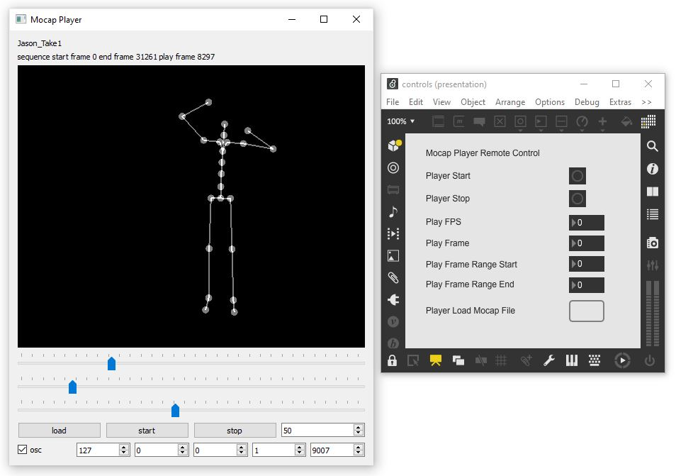

## AI-Toolbox - Motion Utilities - Mocap Player



Figure 1: The figure shows a screenshot of the MocapPlayer software (left window) and an example Max patch (right window) that can be used to remote control the MocapPlayer.

### Summary

The MocapPlayer is a simple Python-based software for playing motion capture data that has been recorded either in [BVH](https://en.wikipedia.org/wiki/Biovision_Hierarchy#:~:text=BioVision%20Hierarchy%20(BVH)%20is%20a,acquired%20by%20Motion%20Analysis%20Corporation.) or [FBX](https://en.wikipedia.org/wiki/FBX#:~:text=FBX%20(from%20Filmbox)%20is%20a,series%20of%20video%20game%20middleware.) format. While playing, the software sends skeleton joint data in the form of local and global positions and local and global rotations via [OSC](https://en.wikipedia.org/wiki/Open_Sound_Control) to any destination address. The software can also be remote controlled via OSC.

### Installation

The software runs within the *premiere* anaconda environment. For this reason, this environment has to be setup beforehand.  Instructions how to setup the *premiere* environment are available as part of the [installation documentation ](https://github.com/bisnad/AIToolbox/tree/main/Installers) in the [AI Toolbox github repository](https://github.com/bisnad/AIToolbox). 

The software can be downloaded by cloning the [MotionUtilities Github repository](https://github.com/bisnad/MotionUtilities). After cloning, the software is located in the MotionUtilities / MocapPlayer directory.

### Directory Structure

- MocapPlayer (contains software specific python scripts)
  - common (contains python scripts for handling mocap data)
  - controls (contains a MaxMSP patch to remote control the software)
  - data 
    - media (contains media used in this Readme)
    - mocap (contains an example mocap recording)

### Usage

#### Start

The software can be started either by double clicking the mocap_player.bat (Windows) or mocap_player.sh (MacOS) shell scripts or by typing the following commands into the Anaconda terminal:

```
conda activate premiere
cd MocapPlayer
python mocap_player.py
```

#### Default Mocap File

When the software starts, it automatically reads an example motion capture file that is located in the MocapPlayer/data/mocap folder. An alternative mocap file can be read either when the software starts or while it is running. In the latter case, the software can only read mocap files that contain the same skeleton topology as the mocap file that was read during startup. To read a different mocap file during software startup, the following source code in the file mocap_player.py has to be modified:

```
motion_player.config = { 
    "file_name": "data/mocap/Muriel_Take1.fbx",
    "fps": 50
    }
```

In this code, the string "data/mocap/Muriel_Take1.fbx" needs to be replaced to specify a path to a different mocap file. If necessary, the number "50" can also be replaced to specify a different frame rate for playback.  

#### Functionality

The software can play motion capture recordings of a single performer that have been saved in [FBX](https://en.wikipedia.org/wiki/FBX#:~:text=FBX%20(from%20Filmbox)%20is%20a,series%20of%20video%20game%20middleware.) or [BVH](https://en.wikipedia.org/wiki/Biovision_Hierarchy#:~:text=BioVision%20Hierarchy%20(BVH)%20is%20a,acquired%20by%20Motion%20Analysis%20Corporation.)) format. The playback loops between a user specified start and end frame. While a recording is played, the recorded performer is graphically depicted as a simple stick figure. Also, while the software plays, it sends for each frame the joint information of the performer as [OSC](https://en.wikipedia.org/wiki/Open_Sound_Control) data. This information includes the joint position and rotation both in global and local coordinates. In global coordinates, joint positions and rotations are relative to an absolute reference position and rotation in space.  In local coordinates, joint positions and rotations are relative to the positions and rotations of the parent joints.  Before closing the software, playback has to be stopped.

#### Graphical User Interface

The graphical user interface of the software provides the following functionality or conveys the following information (from top to bottom and left to right):

- A text to display the currently loaded mocap file.
- A text to display the start end frame of the playback range and the currently played frame. 
- A graphical window to display the pose corresponding to the current motion capture frame as a simple stick figure. The rotation, position, and scale of the stick figure can be changed with the mouse. Dragging with the left mouse button rotates the figure. Dragging with the middle mouse button moves the figure. Operating the scroll wheel zooms the figure in and out. 
- A slider to display and change the currently played frame.  
- A slider to set the start frame of the playback range.
- A slider to set the end frame of the playback range.
- Three buttons to load, start, and stop a mocap recording. 
- A number box to change the frames per seconds with which the mocap recording is played.
- An toggle to turn OSC sending on and off.
- Four number boxes to change the IP address to which OSC data is sent to.
- A number box to change the port number box to which OSC data is sent to. 

### OSC Communication

The software sends the following OSC messages representing the joint positions and rotations of the currently displayed motion capture figure.
Each message contains all the joint positions and rotations grouped together. In the OSC messages described below, N represents the number of joints.

The following OSC messages are sent by the software:

- joint positions as list of 3D vectors relative to parent joint: `/mocap/0/joint/pos_local <float j1x> <float j1y> <float j1z> .... <float jNx> <float jNy> <float jNz>` 
- joint positions as list of 3D vectors in world coordinates: `/mocap/0/joint/pos_world <float j1x> <float j1y> <float j1z> .... <float jNx> <float jNy> <float jNz>` 
- joint rotations as list of Quaternions relative to parent joint: `/mocap/0/joint/rot_local <float j1w> <float j1x> <float j1y> <float j1z> .... <float jNw> <float jNx> <float jNy> <float jNz>` 
- joint rotations as list of Quaternions in world coordinates: `/mocap/0/joint/rot_world <float j1w> <float j1x> <float j1y> <float j1z> .... <float jNw> <float jNx> <float jNy> <float jNz>` 

The software can be remote controlled by sending OSC messages to it. By default, the software receives OSC messages on port 9002. To change this port, the following source code in the file mocap_player.py has to be modified:

```
motion_control.config["port"] = 9002
```

In this code, the number 9002 needs to be replaced to specify a different port.

An example Max patch demonstrates the use of the remote control functionality. The following OSC messages can be used to remote control the software. 

- load a motion capture file: `/player/load <string filename>`
- start playback: `/player/start`
- stop playback: `/player/stop`
- set playback speed in fps (frames per second): `/player/fps <int fps>`
- set playback position to specific frame: `/player/frame <int frame>`
- set start frame of playback loop: `/player/start_frame <int frame>`
- set end frame of playback loop: `/player/end_frame <int frame>`

### Limitations and Bugs

- The player only supports motion capture recordings that contain a single person.

- It reads only motion capture recordings in FBX format in which each skeleton pose has its own keyframe and in which the number of keyframes is the same for all skeleton joints.
- The software hangs if it is closed while playing. Always stop the playback before closing the software!


