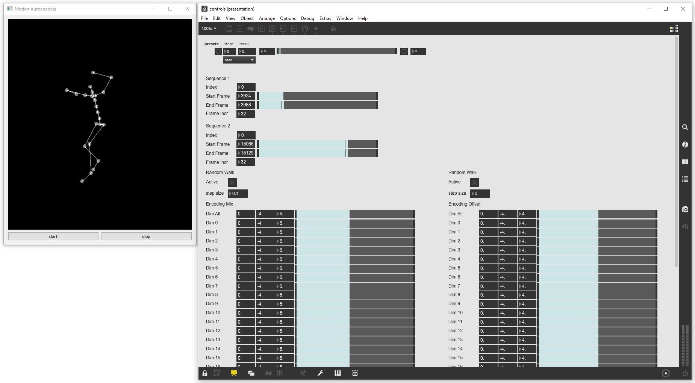

## AI-Toolbox - Motion Continuation - VAE RNN Interactive



Figure 1. Screenshot of the VAE RNN Interactive tool. The window on the left shows the output of the model as simple 3D stick figure. The window on the right is a Max/MSP patch that demonstrates how to send OSC messages to control the VAE RNN Interactive tool. 

### Summary

This Python-based tool can be used to interactively control a machine learning model that has been trained to generate synthetic motion data by encoding and decoding short motion excerpts into and from compressed representations. By manipulating the compressed representations, existing motions can be altered or interpolated between or new motions can be generated. The model used here is based on a Variational Autoencoder.  This tool is not able to train a machine learning model. For training, the [VAE-RNN tool](../vae-rnn) can be used. The tool can be interactively controlled by sending it OSC messages. The tool also emits OSC messages that contain the synthetically generated motion data.  

### Installation

The software runs within the *premiere* anaconda environment. For this reason, this environment has to be setup beforehand.  Instructions how to setup the *premiere* environment are available as part of the [installation documentation ](https://github.com/bisnad/AIToolbox/tree/main/Installers) in the [AI Toolbox github repository](https://github.com/bisnad/AIToolbox). 

The software can be downloaded by cloning the [MotionTransformation Github repository](https://github.com/bisnad/MotionTransformation). After cloning, the software is located in the MotionContinuation / vae-rnn_interactive directory.

### Directory Structure

- vae-rnn_interactive
  - common (contains python scripts for handling mocap data)
  - controls (contains an example Max/MSP patch for interactively controlling the tool)
  - data 
    - media (contains media used in this Readme)
    - mocap (contains an example mocap recording)
    - results
      - weights (contains example trained model weights)

### Usage

#### Start

The tool can be started either by double clicking the `vae_rnn_interactive.bat` (Windows) or `vae_rnn_interactive.sh` (MacOS) shell scripts or by typing the following commands into the Anaconda terminal:

```
conda activate premiere
cd MocapTransformation/vae-rnn_interactive
python vae_rnn_interactive.py
```

##### Motion Data and Weights Import

During startup, the tool loads one or several mocap capture files and the model weights from a previous training run. By default, the tool loads these files from an example training run whose results are stored in the local data/results folder.  This training run is based on an XSens recording of a solo improvisation. The model was trained on this data to generate synthetic motion data by encoding and decoding short motion excerpts into and from compressed representations. To load a different training run, the following source code has to be modified in the file `vae_rnn_interactive.py.` 

```
mocap_file_path = "data/mocap"
mocap_files = ["Muriel_Embodied_Machine_variation.fbx"]
mocap_pos_scale = 1.0
mocap_fps = 50

encoder_weights_file = "data/results/weights/encoder_weights_epoch_200"
decoder_weights_file = "data/results/weights/decoder_weights_epoch_200"
```

The string value assigned to the variable `mocap_file_path` specifies the path to the folder that contains motion data files. The list of string values assigned to the variable `mocap_files` specifies the names of the motion data files that will be loaded. The float value assigned to the variable `mocap_pos_scale` specifies a scaling value that is applied to joint positions. The purpose of the scaling value is to bring the position values to cm units. The integer value assigned to the variable `mocap_fps` specifies the number of frames per second with which the motion data is stored. The string value assigned to the variables `encoder_weights_file` and `decoder_weights_file` specifies the path to the stored weights for the encoder and decoder of a previous training run, respectively.

##### Model Settings

The Variatonal Autoencoder consists of two models: the encoder and the decoder. Both the encoder and decoder consist of one or several [Long Short Term Memory](https://www.researchgate.net/publication/13853244_Long_Short-Term_Memory) (LSTM) layers and fully connected layers (Dense) layers.  By default, the encoder and decoder employ 2 LSTM layers with 512 units each and three Dense layers. The number of units for the first and last Dense layer is automatically calculated. The number of units for the middle Dense layer(s) is by default 512. The dimension of the latent vector is by default 32 and the length of motion sequence the model operates on is by default 64. All these settings need to be identical to the ones used when training the motion transformation model. To use different model settings and/or a different length for the motion sequence, the following source code in the file `vae_rnn_interactive.py` has to be modified:

```
latent_dim = 32
sequence_length = 64
ae_rnn_layer_count = 2
ae_rnn_layer_size = 512
ae_dense_layer_sizes = [ 512 ]
```

The integer value assigned to the variable `latent_dim` specifies the dimension of the latent vector representation. The integer value assigned to the variable `sequence_length` specifies the length (in number of frames) of the motion excerpt the Autoencoder operates on. The integer value assigned to the variable `ae_rnn_layer_count` specifies the number of LSTM layers in the encoder and decoder models. The integer value assigned to the variable `ae_rnn_layer_size` specifies the number of units per LSTM layer in the encoder and decoder models. The list of integer values assigned to the variable `ae_dense_layer_sizes` specifies the number of units in the Dense layers in the encoder and decoder with the exception of the first and last Dense layer (for which the number of units is determined automatically).

#### Functionality

While running, the tool continuously extracts two short motion excerpts at specific frame indices from motion capture files that have been loaded during startup. The motion excerpts can either originate from a single file or from two different files. As time progresses, the tool increments the two extraction frame indices by a user specified offset. The two frame indices change within the limits of two user specified frame ranges, one for each motion capture file from which the excerpts are taken from. When the extraction frame index for one of the motion files exceeds the upper end of the corresponding frame range, the frame index wraps around to the lower end of the frame range. For every time step, the two motion excerpts are passed as inputs into the encoder that then outputs the mean and standard deviations of two corresponding normal distributions from which two latent vectors are sampled. Before these vectors are passed into the decoder which then generates a new motion excerpt, the latent vectors can be manipulated by the user. The manipulation involves merging the two latent vectors into one latent vector by interpolating or extrapolating between them, and adding an arbitrary latent vector to the merged latent vector. Interpolating the latent vectors has the effect of generating a new motion excerpt that combines aspects of both original motion excerpts. Extrapolating the latent vectors has the effect of generating a new motion excerpt that exaggerates the differences between the original motion excerpts. Adding an latent vector to the merged latent vector has the effect of varying the original motion excerpts. The larger the values in the added latent vector, the stonger the effect of the variation becomes. The latent vector that results from these manipulations is then passed as input into the decoder that generates a new motion excerpt. This newly generated motion excerpt is blended together with the previously generated motion excerpt by interpolating the joint rotations using quaternion slerp. This procedure continues until the tool is stopped. While running, the behaviour of the tool can be controlled by sending it OSC messages. The tool also displays the poses as simple 3D stick figure and outputs them OSC messages. 

### Graphical User Interface

The tool provides a minimal GUI  for starting and stopping the motion continuation and for displaying the generated motions as a simple 3D stick figure (see Figure 1 left side).

### OSC Communication

The tool receives OSC messages that modify its behaviour. Some OSC messages change the motion files and frame regions from which motion excerpts are extracted. Other OSC messages affect the manipulation and combination of the encoded motion excerpts into a single latent vector representation that is then decoded into a new motion excerpt.  In the OSC messages described below, N represents the number of latent dimensions.

The following OSC messages are received by the tool:

- Specifies by index of a first motion capture file from which motion excerpts are extracted  : `/mocap/seq1index <integer file_index>`
- Specifies by index of a second motion capture file from which motion excerpts are extracted  : `/mocap/seq2index <integer file_index>`
- Specifies by start and end frame index of a frame region within the first motion capture file from which motion excerpts are extracted  : `/mocap/seq1framerange <integer frame_index_start> <integer frame_index_end> `
- Specifies by start and end frame index of a frame region within the second motion capture file from which motion excerpts are extracted  : `/mocap/seq2framerange <integer frame_index_start> <integer frame_index_end> `
- Specifies the offset in number of frames by which the frame position at which motion excerpts from a first motion capture file are extracted are incremented in successive extraction steps: `/mocap/seq1frameincr <integer frame_offset>`
- Specifies the offset in number of frames by which the frame position at which motion excerpts from a second motion capture file are extracted are incremented in successive extraction steps: `/mocap/seq2frameincr <integer frame_offset>`
- Specifies for each latent dimension the interpolation or extrapolation value with which the two encoded motion excerpts are combined. A value between 0.0 and 1.0 corresponds to an interpolation. A value smaller than 0.0 or larger than 1.0 corresponds to an extrapolation: `/synth/encodingmix <float ld1>  ... <float ldN>`
- Specifies for each latent dimension that offset value that is added to the combined latent vector: `/synth/encodingoffset <float ld1>  ... <float ldN>`

By default, the tool receives OSC messages from any IP address and on port 9002. To change the IP address and/or port, the following code in the file `vae_rnn_interactive.py` has to be changed:

```
osc_receive_ip = "0.0.0.0"
osc_receive_port = 9002
```

The string value assigned to the variable  `osc_receive_ip` specifies the IP address of the computer from which the tool receives OSC messages. "0.0.0.0" represents any IP address. The integer value assigned to the variable `osc_receive_port` specifies the port on which the tool receives OSC messages.


The software sends the following OSC messages representing the joint positions and rotations of a pose within the newly generated motion excerpt.
Each message contains all the joint positions and rotations grouped together. In the OSC messages described below, N represents the number of joints.

The following OSC messages are sent by the software:

- joint positions as list of 3D vectors in world coordinates: `/mocap/0/joint/pos_world <float j1x> <float j1y> <float j1z> .... <float jNx> <float jNy> <float jNz>` 
- joint rotations as list of Quaternions in world coordinates: `/mocap/0/joint/rot_world <float j1w> <float j1x> <float j1y> <float j1z> .... <float jNw> <float jNx> <float jNy> <float jNz>` 

By default, the tool sends OSC messages to IP address "127.0.0.1" and to port 9004. To change the IP address and/or port, the following code in the file `vae_rnn_interactive.py` has to be changed:

```
osc_send_ip = "127.0.0.1"
osc_send_port = 9004
```

The string value assigned to the variable  `osc_send_ip` specifies the IP address of the computer to which the tool sends OSC messages. "127.0.0.1" represents the same computer on which the tool is running. The integer value assigned to the variable `osc_send_port` specifies the port to which the tool sends OSC messages.

### Limitations and Bugs

- The tool only generates synthetic motions for a single person.
- The tool reads only motion capture recordings in FBX format in which each skeleton pose has its own keyframe and in which the number of keyframes is the same for all skeleton joints.
