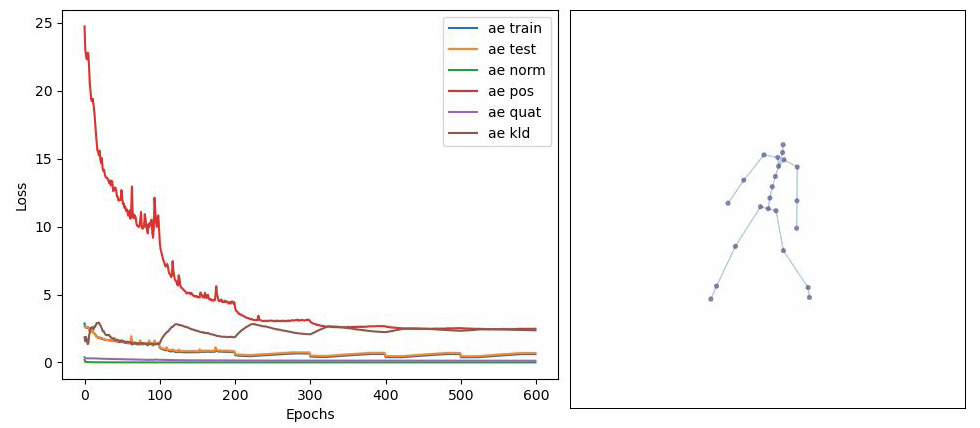

## AI-Toolbox - Motion Continuation - VAE RNN



Figure 1. Screenshot of the Motion Transformation tool after training concluded. The image on the left depicts the learning progress as graph plot. The image on the right is a still from a GIF animation that shows a motion generated by the model.

### Summary

This Python-based tool implements a machine learning model that can be trained to generate synthetic motion data by encoding and decoding short motion excerpts into and from compressed representations. By manipulating the compressed representations, existing motions can be altered or interpolated between or new motions can be generated. The model used here is based on a Variational Autoencoder. This tool doesn't operate in real-time and is used exclusively for training the machine learning model. Once a model is trained, it can be used in combination with other tools that generate synthetic motions in real-time and can be interactively controlled. 

### Installation

The software runs within the *premiere* anaconda environment. For this reason, this environment has to be setup beforehand.  Instructions how to setup the *premiere* environment are available as part of the [installation documentation ](https://github.com/bisnad/AIToolbox/tree/main/Installers) in the [AI Toolbox github repository](https://github.com/bisnad/AIToolbox). 

The software can be downloaded by cloning the [MotionTransformation Github repository](https://github.com/bisnad/MotionTransformation). After cloning, the software is located in the MotionTransformation / vae-rnn directory.

### Directory Structure

- vae-rnn
  - common (contains python scripts for handling mocap data)
  - data 
    - configs (contains configurations for skeleton representations used by various Pose Estimation systems and lists of loss weights for joints in skeletons that include hand joints)
    - media (contains media used in this Readme)
    - mocap (contains an example mocap recording)
  - results
    - anims (after training, contains synthetic motion data exported as Gif animations and FBX/BVH files)
    - histories (after training, contains logs of the training process as csv file and graph plot)
    - weights (after training, contains the weights of the trained model)

### Usage

#### Start

The tool exists in two versions. The version named `vae_rnn` is used to train the machine learning model on motion data that stores both joint rotations and positions and that is stored in BVH or FBX format. The version named `vae_rnn_pos` is used to train the machine learning model on motion data that stores only joint positions and that is stored in PKL format. The first version of the tool can be started by double clicking the vae_rnn.bat (Windows) or vae_rnn.sh (MacOS) shell scripts or by typing the following commands into the Anaconda terminal:

```
conda activate premiere
cd MocapTransformation/vae_rnn
python vae_rnn.py
```

The second version of the tool can be started by double clicking thevae_rnn_pos.bat (Windows) or vae_rnn_pos.sh (MacOS) shell scripts or by typing the following commands into the Anaconda terminal:

```
conda activate premiere
cd MocapTransformation/vae_rnn
python vae_rnn_pos.py
```

#### Functionality

##### VAE RNN Motion Data Import

This tool imports motion data from one or several motion files that are stored either in FBX or BVH format. These motion files are then used to create the training set. By default, the tool loads the motion file `Muriel_Embodied_Machine_variation.fbx` in the `data/mocap` folder. To read different motion files, the the following source code in the file `vae_rnn.py` has to be modified:

```
mocap_file_path = "data/mocap"
mocap_files = ["Muriel_Embodied_Machine_variation.fbx"]
mocap_pos_scale = 1.0
mocap_fps = 50
mocap_loss_weights_file = None
```

The string value assigned to the variable `mocap_file_path` specifies the path to the folder that contains motion data files. The list of string values assigned to the variable `mocap_files` specifies the names of the motion data files that will be loaded. The float value assigned to the variable `mocap_pos_scale` specifies a scaling value that is applied to joint positions. The purpose of the scaling value is to bring the position values to cm units. The integer value assigned to the variable `mocap_fps` specifies the number of frames per second with which the motion data is stored. This value has no influence on training but affects the synthetic motion data that is exported at the end of a training run. The string value assigned to the variable `mocap_loss_weights_file` specifies the path to a configuration file that contains loss scales for skeleton joints. Loading such a configuration file is recommended for motion  data that contains multiple joints per hand in order to reduce the influence of the hand joints on the overall loss calculation during training. If the motion data doesn't contain multiple hand joints, then this variable can be set to `None`. 

##### VAE RNN Pos Motion Data Import

This tool imports motion data from one or several motion files that are stored in PKL format. These files can be created by recording the OSC messages generated by one of the Pose Estimation Tools included in the AI-Toolbox with the MocapRecorder tool. These motion files are then used to create the training set. By default, the tool loads the motion file `Stocos_Pose2D_BlumenBaile.pkl` in the `data/mocap` folder. To read different motion files, the the following source code in the file `vae_rnn_pos.py` has to be modified:

```
mocap_config_file = "data/configs/COCO_config.json" 
mocap_file_path = "data/mocap"
mocap_files = ["Stocos_Pose2D_BlumenBaile.pkl"]
mocap_sensor_ids = ["/mocap/0/joint/pos_world", "/mocap/0/joint/visibility"]
mocap_root_joint_name = "Left_Hip"
mocap_fps = 30
mocap_joint_dim = 2
```

In the following, only the variables that differ from those in the `vae_rnn.py` source file are described. The string value assigned to the variable `mocap_config_file` specifies the skeleton representation used by the Pose Estimation tool when creating the recording.  The list of string values assigned to the variable `mocap_sensor_ids` specify the address parts of the OSC messages that contain motion data required for created the dataset. The second string value in this list differs between 2D and 3D motion data. For 2D motion data, the string value needs to be "/mocap/0/joint/visibility". For 3D motion data, the string value needs to be "/mocap/0/joint/scores". Both these variants are used to scale the contribution of each keypoint to the training loss. For motion data obtained with a 2D Pose Estimation tool, the "visibility" of the keypoints serves as scaling factor. For motion data obtained with a 3D Pose Estimation tool, the "score" of the keypoints serves as scaling factor.  The string value assigned to the variable `mocap_root_joint_name` specifies the name of the joint that serves as root joint.  The integer value assigned to the variable `mocap_joint_dim`specifies the number of dimensions of the joint positions. This value is 2 for motion data that has been captured with a 2D Pose Estimation tool, and 3 for motion data that has been captured with a 3D Pose Estimation tool.

#### Functionality

The tool extracts the required motion data from the imported motion files into motion sequences, splits these sequences into short segments to create the dataset, then constructs and initialises machine learning model, trains this model using on the dataset, and finally stores the trained models weights, the training history, and examples of original and generated motion sequences. 

##### Model Settings

The Variational Autoencoder consists of a total of two models: the encoder and the decoder. The encoder takes as input a short motion excerpt and outputs the mean and standard deviation of a normal distribution. A latent vector can be obtained by sampling from this distribution. The decoder takes as input a latent vector and decompresses it into a short motion excerpt. Both the encoder and decoder consist of one or several [Long Short Term Memory](https://www.researchgate.net/publication/13853244_Long_Short-Term_Memory) (LSTM) layers and fully connected layers (Dense) layers.  The number of units for the first and last Dense layer is automatically calculated. The number of units for the middle Dense layer(s) is by default 512. Other than that, the dimension of the latent vector representation of motion excerpts has to be specified. The default value for this dimension is 32. When constructing the models, their weights can either be initialised with random values or with values that have been determined in a previous training run. To use different models settings, the the following source code in the file`vae_rnn.py` or `vae_rnn_pos.py` has to be modified:

```
latent_dim = 32
sequence_length = 64
ae_rnn_layer_count = 2
ae_rnn_layer_size = 512
ae_dense_layer_sizes = [ 512 ]

save_weights = True

# load model weights
load_weights = False
encoder_weights_file = "results_xsens_64/weights/encoder_weights_epoch_600"
decoder_weights_file = "results_xsens_64/weights/decoder_weights_epoch_600"
```

The integer value assigned to the variable `latent_dim` specifies the dimension of the latent vector representation. The integer value assigned to the variable `sequence_length` specifies the length (in number of frames) of the motion excerpt the Autoencoder operates on. The integer value assigned to the variable `ae_rnn_layer_count` specifies the number of LSTM layers in the encoder and decoder models. The integer value assigned to the variable `ae_rnn_layer_size` specifies the number of units per LSTM layer in the encoder and decoder models. The list of integer values assigned to the variable `ae_dense_layer_sizes` specifies the number of units in the Dense layers in the encoder and decoder with the exception of the first and last Dense layer (for which the number of units is determined automatically). The boolean value assigned to the variable `load_weights` specifies if the models should be initialised with previously stored weights or not. The string values assigned to the variables `encoder_weights_file` and`decoder_weights_file` specify the paths to the previously exported weights file for the encoder and decoder, respectively. 

##### Dataset Settings

The dataset consists of short motion sequences that have been extracted from the loaded motion files. The motion sequences consist of a time series of values that represent at each timestep a full skeleton pose. In the case of `vae_rnn.py`,  a pose is represented by joint orientations using quaternions. In the case of `vae_rnn_pos.py`, a pose is represented by joint positions using 2D or 3D vectors. 

##### Training Settings

During training, a short motion sequence is passed as input to the encoder. The encoder compresses the motion sequence and outputs a normal distribution from which a latent vector representation can be sampled.  The latent vector representation is then passed to the decoder that decompresses it back into a motion sequence.  At each training step, the loss of the Autoencoder is calculated based on a combination of the reconstruction of the motion sequence and a similarity measure (KL-Divergence) between the output of the encoder and a unit distribution. The influence of the KL-Divergence loss on the overall training loss cyclically varies over time. 

##### VAE RNN Training Settings

In `vae_rnn.py`, the loss of the autoencoder is calculated as a combination of several losses. These are: 

- variational_loss: loss based on the KL-Divergence between mean and standard deviation output by encoder and a unit distribution.
- ae_norm_loss: loss based on the deviation of the reconstructed joint rotations from unit quaternions
- ae_pos_loss: loss based on the deviation of the reconstructed joint positions from the correct joint positions. The joint positions are derived from joint rotations using forward kinematics. 
- ae_quat_loss: loss based on the deviation of the reconstructed joint rotations from the correct joint rotations.

When running the tool, it employs default training settings. To change these settings, the follows source code in the file `vae_rnn.py` has to be changed:

```
sequence_offset = 2
batch_size = 16
test_percentage  = 0.2
ae_learning_rate = 1e-4
ae_norm_loss_scale = 0.1
ae_pos_loss_scale = 0.1
ae_quat_loss_scale = 1.0
ae_kld_loss_scale = 0.0
kld_scale_cycle_duration = 100
kld_scale_min_const_duration = 20
kld_scale_max_const_duration = 20
min_kld_scale = 0.0
max_kld_scale = 0.1

epochs = 600
model_save_interval = 50
```

The integer value assigned to the variable `sequence_offset` specifies the offset (in number of frames) used when extracting motion excerpts from the loaded motion files. The integer value assigned to the variable `batch_size` specifies the number of motion examples in a training batch. The float value assigned to the variable `test_percentage` specifies the percentage of training data used for testing the model. The float value assigned to the variable `ae_learning_rate` specifies the initial learning rate for the encoder and decoder. The float value assigned to the variable `norm_loss_scale` specifies the weighted contribution of the quaternion normalisation loss to the overall autoencoder training loss. The float value assigned to the variable `pos_loss_scale` specifies its weighted contribution of the joint position reconstruction loss to the overall autoencoder training loss. The float value assigned to the variable `quat_loss_scale` specifies its weighted contribution to the joint rotation reconstruction loss to the overall autoencoder training loss. The float value assigned to the variable `ae_kld_loss_scale` specifies the weighted contribution of the KL-Divergence loss to the overall autoencoder training loss. This value will is automatically calculated during training. The integer value assigned to the variable `kld_scale_cycle_duration` specifies the duration (in number of epochs) of a cycle during which the KL Divergence scale increases from a minim to a maximum value. The minimum value is specified by the float value assigned to the variable  `min_kld_scale`. The maximum value is specified by the float value assigned to the variable  `max_kld_scale`.  The integer value assigned to the variable `kld_scale_min_const_duration` specifies the duration (in number of epochs) at the beginning of a cycle during which the KL Divergence scale is constant and has a minimum value. The integer value assigned to the variable `kld_scale_max_const_duration` specifies the duration (in number of epochs) at the end of a cycle during which the KL Divergence scale is constant and has a maximum value. The integer value assigned to the variable epochs specifies the number of `epochs` used for training. The integer value assigned to the variable `model_save_interval` specifies the interval (in number of epochs) at which model weights are stored. 

##### VAE RNN Pos Training Settings

In `vae_rnn_pos.py`, the loss of the autoencoder is calculated as a combination of only two losses. These are: 

- variational_loss: loss based on the KL-Divergence between mean and standard deviation output by encoder and a unit distribution.
- ae_pos_loss: loss based on the deviation of the reconstructed joint positions from the correct joint positions. The joint positions are derived from joint rotations using forward kinematics. 

When running the tool, it employs default training settings. To change these settings, the follows source code in the file `vae_rnn_pos.py` has to be changed:

```
sequence_offset = 2
batch_size = 16
test_percentage  = 0.2
ae_learning_rate = 1e-4
ae_pos_loss_scale = 1.0
ae_kld_loss_scale = 0.0
kld_scale_cycle_duration = 100
kld_scale_min_const_duration = 20
kld_scale_max_const_duration = 20
min_kld_scale = 0.0
max_kld_scale = 0.1

epochs = 200
model_save_interval = 50
```

The role of these variables is the same as in `vae_rnn.py`.

##### Training 

Once the dataset has been created and the model initialised, training begins and runs for the number of epochs specified by the user. During training, the tool prints for each epoch a log message to the console that provide information about the training progress. 

An example log message produced by `vae_rnn.py` looks like this:

`epoch 1 : ae train: 2.9187 ae test: 2.5982 norm 0.2250 pos 25.2427 quat 0.3720 kld 2.1472 time 9.71`

The information specifies, from left to right: the epoch number, the overall loss of the autoencoder on the train set, the overall loss of the autoencoder on the test set, the quaternion normalisation loss, the joint position loss, the joint rotation loss, the KL-Divergence loss ,and the time elapsed. 

An example log message produced by `vae_rnn_pos.py` looks like this:

`epoch 1 : ae train: 0.9696 ae test: 0.8452 pos 0.9696 kld 2.7603 time 2.80`

The information specifies, from left to right: the epoch number, the overall loss of the autoencoder on the train set, the overall loss of the autoencoder on the test set, the joint position loss, the KL-Divergence loss, and the time elapsed. 

At the end of training, the tool displays the training history as graph plot, and stores the training history both as image and `.csv` file, the last model weights, and an original and predicted motion sequence exported either as BVH or FBX file and GIF animation in case of `vae_rnn.py` or as PKL file and GIF animation in case of `vae_rnn_pos.py`.

### Limitations and Bugs

- The tool only supports motion capture recordings that contain a single person.
- `aae_rnn.py` reads only motion capture recordings in FBX format in which each skeleton pose has its own keyframe and in which the number of keyframes is the same for all skeleton joints.


